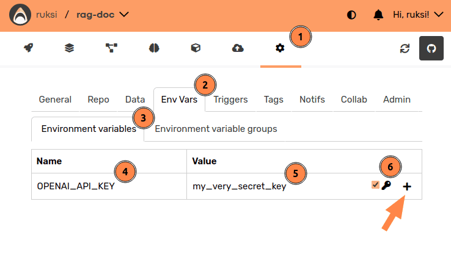

# Retrieval-Augmented Generation with Documentation

#### <i>aka. RAG Doctor</i> 🧑‍⚕️

This repository showcases a Retrieval-Augmented Generation (**RAG**) system for interacting with
documentation that uses natural language queries to retrieve and summarize relevant information.

[](https://github.com/user-attachments/assets/462ee24c-6798-42b3-8dea-80f37cb49e5f)

[valohai-website]: https://valohai.com/

[valohai-app]: https://app.valohai.com/

[valohai-templates]: https://app.valohai.com/projects/import-tutorial/

[qdrant-website]: https://qdrant.tech/

[openai-platform]: https://platform.openai.com/

[openai-api-keys]: https://platform.openai.com/docs/quickstart#create-and-export-an-api-key

## Overview

- Creates a [Qdrant](qdrant-website) vector database for embeddings from the given CSV file(s)
    - The vector database is used for fast similarity search to find relevant documentation
    - _We use a CSV based on Hugging Face documentation as an example_
- Uses OpenAI's embeddings for similarity search and GPT models for high-quality responses
- Provides an interactive interface for querying the documentation using natural language
- Each query retrieves the most relevant documentation snippets for context
- Answers include source links for reference

## Prerequisites

- [Valohai](valohai-website) account to run the pipelines
- [OpenAI](openai-platform) account to use their APIs
- Less than $5 in OpenAI credits

## Setup

If you can't find this project in your [Valohai Templates](valohai-templates), you can set it up
manually:

1. Create a new project on [Valohai](valohai-app)
2. Set the project repository to: `https://github.com/valohai/rag-doc-example`

   

3. Save the settings and click "Fetch Repository"

   </br>
   This makes sure the project is up to date

4. 🔑 [Create an OpenAI API key](openai-api-keys) for this project
    - We will need the API key next so record it down

5. Assign the API key to this project:

   </br>
   You will see _✅ Changes to OPENAI_API_KEY saved_ if everything went correctly.

And now you are ready to run the pipelines!

## Usage


1. Navigate to the "Pipelines" tab
2. Click the "Create Pipeline" button
3. Select the "assistant-pipeline" pipeline template
4. Click the "Create pipeline from template" button
5. Feel free to look around and finally click the "Create pipeline" button

This will start the pipeline:

</br>
_Feel free to explore around while it runs._

When it finishes, the last step will contain qualitative results to review:

</br>
_This manual evaluation is a simplification how to validate the quality of the generated
responses. "LLM evals" is a large topic outside the scope of this particular example._

Now you have a mini-pipeline that maintains a RAG vector database and allows you to ask questions
about the documentation. You can ask your own questions by creating new executions based on the
"do-query" step.

## Next Steps

### Automatic Deployment

The repository also contains a pipeline "assistant-pipeline-with-deployment" which deploys the RAG
system to an HTTP endpoint after a manual human validation of the "manual-evaluation" pipeline step.

<details>
<summary>🤩 Show Me!</summary>

1. Create a Valohai Deployment to tell where the HTTP endpoint should be hosted:

   </br>
   _You can use **Valohai Public Cloud** and **valohai.cloud** as the target when trialing out. Make
   sure to name the deployment `public`_

2. Create a pipeline as we did before, but use the "assistant-pipeline-with-deployment" template.

   </br>
   _The pipeline should look something like this._

3. The pipeline will halt to a "⏳️ Pending Approval" state, where you can click the "Approve" button
   to proceed.

   

4. After approval, the pipeline will build and deploy the endpoint.

   

5. You can use the "Test Deployment" button to run a test queries against the endpoint.

   
   

</details>

### Using Other Models

This example uses OpenAI for both the embedding and query models.

Either could be changed to a different provider or a local model.

<details>
<summary>🤩 Show Me!</summary>

Changing models inside the OpenAI ecosystem is a matter of changing constants in
`src/rag_doctor/consts.py`:

```python
EMBEDDING_MODEL = "text-embedding-ada-002"
EMBEDDING_LENGTH = 1_536  # the dimensions of a "text-embedding-ada-002" embedding vector

PROMPT_MODEL = "gpt-4o-mini"
PROMPT_MAX_TOKENS = 128_000  # model "context window" from https://platform.openai.com/docs/models
```

Further modifying the chat model involves reimplementing the query logic in
`src/rag_doctor/query.py`.

Similarly, modifying the embedding model is a matter of reimplementing the embedding logic in both
`src/rag_doctor/database.py` and `src/rag_doctor/query.py`.

**If you decide to change the embedding model, remember to recreate the vector database.**

</details>

### RAG Evaluation Pipeline

This repository includes a comprehensive evaluation system that measures RAG performance across three key dimensions: retrieval quality, generation accuracy, and operational efficiency.

<details>
<summary>🤩 Show Me!</summary>

#### What Gets Evaluated

**Retrieval Metrics:**
- **Recall@K**: Uses LLM-as-a-judge to assess whether retrieved documents contain the information needed to answer the question correctly
- **Response Rate**: Percentage of questions that receive valid responses

**Generation Metrics:**
- **Factuality Score**: LLM-based evaluation of answer accuracy (1-5 scale)
- **Response Quality**: Average length and substantive response rate

**Operational Metrics:**
- **Latency**: Estimated response time per query
- **Cost**: Token-based cost estimation for embeddings and LLM calls

#### How to Run Evaluation
**⚠️ Important:** Make sure you have the appropriate API keys configured in your project environment variables:
- For OpenAI models: `OPENAI_API_KEY` (already set up from the initial setup)
- For Anthropic models: Add `ANTHROPIC_API_KEY` if using `provider: anthropic`
- For other providers: Add the corresponding API key as needed

1. Navigate to the "Pipelines" tab and create a new pipeline
2. Select the "rag-evaluation-pipeline" template
3. Select which model provider you would like to evaluate (default: OpenAI) and the questions to test the knowledge base on.
   
4. The pipeline will:
   - Create embeddings from your documentation
   - Generate responses to evaluation questions
   - Run comprehensive evaluation metrics (for other evaluation metrics, you can customize `evaluate.py` accordingly)
   


#### Evaluation Results

The evaluation step produces detailed metrics logged to Valohai's metadata system:
```json
{
  "response_rate": 1.0,
  "recall_at_k": 0.85,
  "factuality_score": 4.2,
  "avg_response_length": 841.25,
  "substantive_rate": 0.9,
  "estimated_latency_seconds": 2.041,
  "estimated_cost_usd": 0.0021
}
```


These metrics help you:
- **Monitor system performance** over time
- **Compare different models or configurations**
- **Validate changes** before deploying to production
- **Understand cost implications** of your RAG system

#### Using Custom Evaluation Questions

The pipeline includes gold standard questions with ground truth answers for evaluation. You can customize these by:

1. Creating your own evaluation dataset with columns: `question`, `ground_truth_answer`
2. Updating the `gold_standards` input in the `evaluate-rag` step in `valohai.yaml`
3. Modifying the questions in the pipeline configuration

This evaluation framework follows MLOps best practices, providing the metrics needed to maintain and improve your RAG system in production.

### Multi-Provider Comparison
You can compare different LLM providers (OpenAI vs Anthropic) side-by-side to understand their performance characteristics and make informed decisions about which model works best for your use case, by leveraging the **Task** feature in Valohai. 

1. Navigate to the "Pipelines" tab and create a new pipeline
2. Select the "rag-evaluation-pipeline" template
3. Select the `generate-responses` node and convert it to a Task.
   

This will automatically create executions for the model providers available in the `provider` parameter.

</details>

### Using Your Own Documentation

You can take a look at the input file given to the "embedding" node and create a similar CSV from
your own documentation and replace the input with that CSV.

### Running it Locally

You can also run the individual pieces locally by following instructions in
the [DEVELOPMENT](./DEVELOPMENT.md) file.
